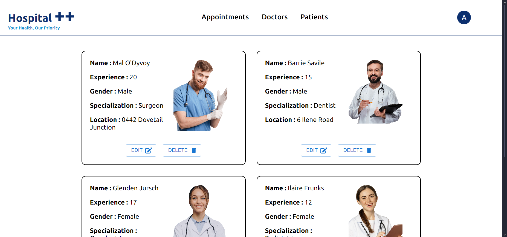
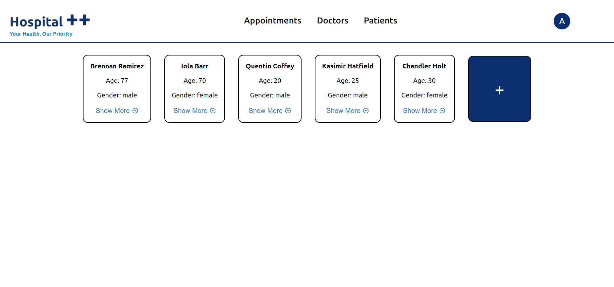
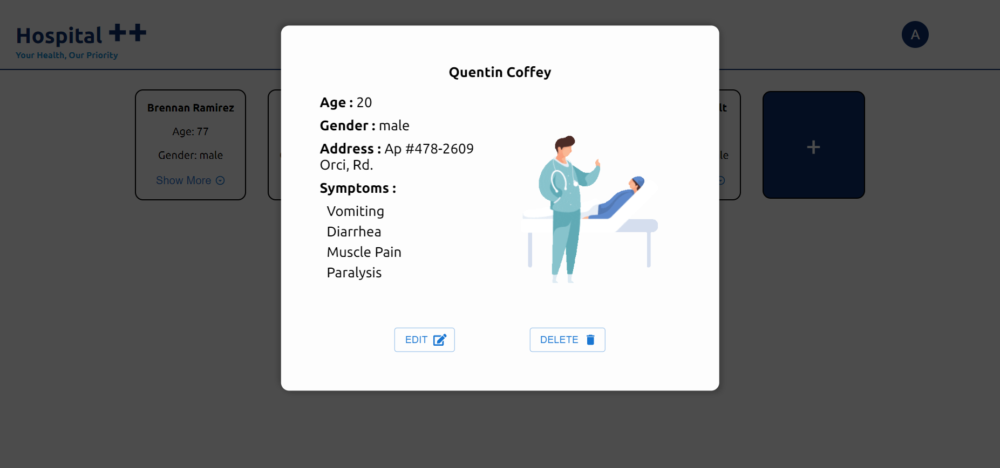
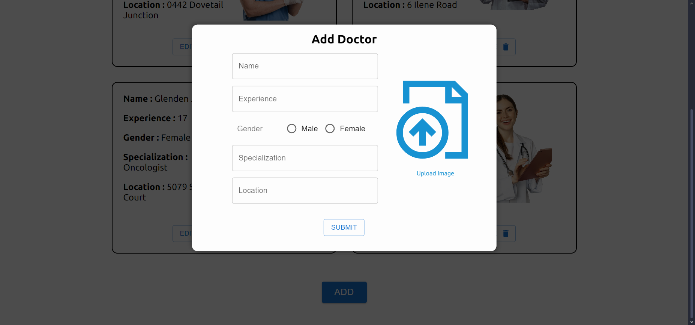
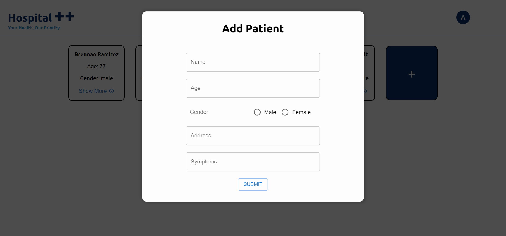

# 🏥Hospital Management System

## Project Overview
This project is a user-friendly web application designed to streamline hospital operations by managing patient records, doctor schedules, and appointments efficiently.

## Tech Stack
- **Frontend:** React, Material UI (for sleek, reusable components), Framer Motion (for smooth animations), React Icons (for intuitive visual elements)  
- **Backend:** Node.js, Express  
- **Database:** MongoDB (for secure and efficient data storage)

## Key Features
- **Modern UI:** A clean and interactive user interface built with Material UI for a professional look and feel.
- **Smooth Animations:** Enhanced user experience with Framer Motion animations.
- **Responsive Design:** Works seamlessly across devices, including phones, tablets, and desktops.
- **Icon Integration:** Visual cues with React Icons for easier navigation.
- **CRUD Operations:** Effortlessly add, view, update, or delete information about patients and doctors.
- **Core Functionalities:**
  - Manage patient records
  - Handle doctor schedules
  - Track and set appointments
  - Maintain staff details

## Getting Started

### Prerequisites
Ensure you have the following installed on your system:
- Node.js
- MongoDB

### Installation Steps
1. **Clone the Repository:**
   ```bash
   git clone https://github.com/YourUsername/Hospital-Management-System.git
   ```

2. **Navigate to the Project Directory:**
   ```bash
   cd Hospital-Management-System
   ```

3. **Install Dependencies:**
   - For the frontend:
     ```bash
     cd frontend
     npm install
     ```
   - For the backend:
     ```bash
     cd ../backend
     npm install
     ```

4. **Run the Backend Server:**
   ```bash
   npm start
   ```

5. **Run the Frontend Server:**
   ```bash
   cd frontend
   npm start
   ```

6. **Access the Application:**
   Open your browser and navigate to:
   ```
   http://localhost:3000
   ```

## Screenshots
- **Doctors:**
  

- **Patients:**
  

- **Patients Info:**
  

- **Add Doctors:**
  
  
- **Add Patients:**
  

## Functional Modules
- **Patient Management:** Add, view, update, and delete patient information.
- **Doctor Management:** Maintain doctor details and add new doctors to the team.
- **Appointments:** Track patient appointments.
- **Data Security:** Ensures sensitive information remains protected.

## Future Features (Upcoming...)
- **Setting up Scheduled Appointments**
- **Adding Location Via Google Maps**
- **Setting up Online Meetings**
- **Much More...**

## Contribution Guidelines
I would love your suggestions for whatever new features should be added to it so feel free to open issues or submit pull requests.

## License
This project is licensed under the [MIT License](LICENSE).

## Acknowledgments
- [Material-UI](https://mui.com/)
- [Framer Motion](https://www.framer.com/motion/)
- [React Icons](https://react-icons.github.io/react-icons/)
- [Node.js](https://nodejs.org/)
- [MongoDB](https://www.mongodb.com/)

Thank you for checking out the project! Happy coding!

